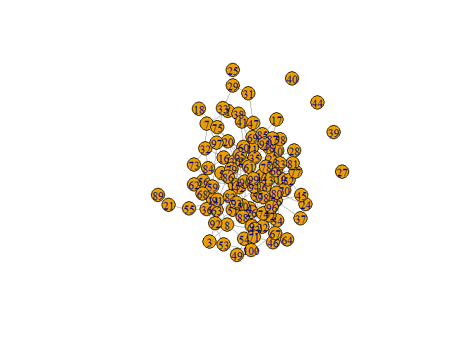
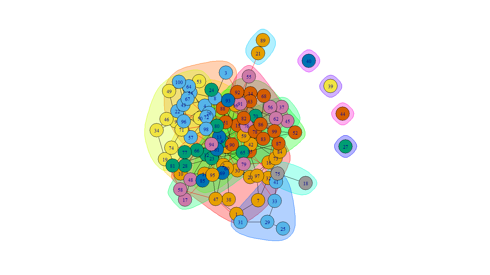
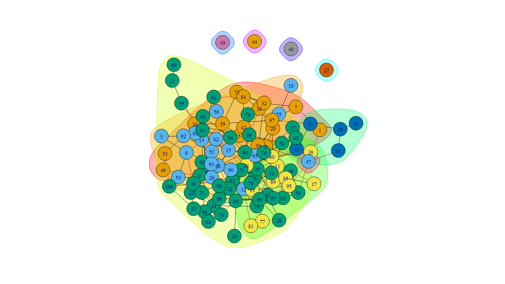

# QUESTÃO 1:

> Suponha que pretende gerar uma rede aleatória não orientada com 100 nodos e grau médio  aproximadamente igual a 4. Qual deve ser a probabilidade utilizada na geração da rede? Gere esta rede. 

O grau médio seria de aproximadamente 100, se todos os nodos estivessem ligados entre si. Neste caso teremos uma probabilidade de 4% - que cada nodo esteja ligado apenas a 4 dos 100 nodos.


É possível determinar o grau médio de uma rede conhecendo o número de nodos e a probabilidade de geração utilizada:

$\langle k\rangle = p(N-1)$

Isto significa que, resolvendo a equação em função de p, temos:

$p = \langle k\rangle / (N-1)$

No nosso caso concreto, o objectivo é obtermos $\langle k\rangle = 4$, tendo $N=100$. Logo, a probabilidade que deverá ser usada na geração da rede aleatória é:

$p = 4/(100-1) \Leftrightarrow p = 4/99 = 0.04 \text{ (aprox.)}$

Ou seja, para obtermos uma rede aletória de 100 nodos e um grau médio de 4, deveremos usar uma probabilidade de 4% na geração das suas ligações.


```r
set.seed(42)
graph1 <- sample_gnp(100, 0.04)
par(mar=c(0,0,0,0))
plot(graph1, edge.color="orange4"
     , edge.width=2
     , vertex.label=NA
     , vertex.size=5
     , vertex.label.cex=0.8
     , vertex.frame.color="orange"
     , vertex.color = "orange"
     )
```

<!-- -->


> Caracterize esta rede quanto ao grau médio dos nodos, à conectividade, distância média e existência de triângulos. Aplique ainda métodos de identificação de comunidades. 

## grau médio


```r
# grau médio
mean(degree(graph1))
```

```
## [1] 3.76
```

O grau médio é próximo de 4, tal como esperaríamos.

## Conectividade


```r
degree(graph1)
```

```
##   [1] 2 5 2 4 4 5 3 5 5 4 5 6 6 3 9 5 2 1 4 5 2 6 4 1 1 5 0 2 3 4 2 4 3 4 7 6 1
##  [38] 1 0 0 2 4 5 0 2 3 5 4 2 4 8 3 3 4 3 2 5 3 6 8 6 3 4 2 5 7 4 3 3 2 4 7 3 2
##  [75] 3 6 3 4 2 9 2 5 4 5 5 5 2 3 1 3 5 4 3 5 4 3 5 4 5 4
```
Vemos que existem 4 nodos com grau zero, o que indica que não têm qualquer ligação. Neste caso estamos perante uma rede desconexa. 

Portanto, existem 4 nodos e uma componente gigante.


```r
components(graph1)
```

```
## $membership
##   [1] 1 1 1 1 1 1 1 1 1 1 1 1 1 1 1 1 1 1 1 1 1 1 1 1 1 1 2 1 1 1 1 1 1 1 1 1 1
##  [38] 1 3 4 1 1 1 5 1 1 1 1 1 1 1 1 1 1 1 1 1 1 1 1 1 1 1 1 1 1 1 1 1 1 1 1 1 1
##  [75] 1 1 1 1 1 1 1 1 1 1 1 1 1 1 1 1 1 1 1 1 1 1 1 1 1 1
## 
## $csize
## [1] 96  1  1  1  1
## 
## $no
## [1] 5
```

## Associação 


```r
# Associação de grau
assortativity_degree(graph1) 
```

```
## [1] -0.08082738
```
É negativo mas muito próximo de zero, por isso não é um rede associativa mas também não se pode concluir que é Não associativa.

Vamos olhar agora para o método de medição da associação de grau com base no 
grau médio dos nodos adjacentes:


```r
knn(graph1)$knnk
```

```
## [1] 5.166667 4.781250 4.666667 4.952381 4.740000 4.428571 4.095238 4.812500
## [9] 4.277778
```

A função tem uma tendência decrescente, mas não estritamente decrescente, oscilando. Por isso mantemos que não é uma rede associativa mas também não pode ser classificada como não associativa.

## Distância média


```r
# distância média
mean_distance(graph1)
```

```
## [1] 3.474123
```

```r
log10(100)
```

```
## [1] 2
```

```r
#diâmetro
diameter(graph1)
```

```
## [1] 8
```

A distância média é grande, já que se afasta substancialmente de $log10(N)$.

A maior distância entre nodos (conectados) é de 8.

## Existência de triângulos


```r
# Coeficiente de clustering
transitivity(graph1, type="global")
```

```
## [1] 0.03453237
```

É um número baixo de triângulos, já que o coeficiente de *clustering* é um rácio entre o número de triângulos e o número total de ternos conexos e este é baixo.

## Identificação de comunidades

Usando o método do corte mínimo:


```r
min_cut(graph1, value.only = F)
```

```
## $value
## [1] 0
## 
## $cut
## + 0/188 edges from 44656de:
## 
## $partition1
## + 96/100 vertices, from 44656de:
##  [1]   1   2   3   4   5   6   7   8   9  10  11  12  13  14  15  16  17  18  19
## [20]  20  21  22  23  24  25  26  28  29  30  31  32  33  34  35  36  37  38  41
## [39]  42  43  45  46  47  48  49  50  51  52  53  54  55  56  57  58  59  60  61
## [58]  62  63  64  65  66  67  68  69  70  71  72  73  74  75  76  77  78  79  80
## [77]  81  82  83  84  85  86  87  88  89  90  91  92  93  94  95  96  97  98  99
## [96] 100
## 
## $partition2
## + 4/100 vertices, from 44656de:
## [1] 27 39 40 44
```

Temos um conjunto com os nodos ligados (a componente gigante) e um outro com os nodos sem qualquer ligação. Com um corte de dimensão zero.

Usando o método das cliques:


```r
sapply(cliques(graph1),length)
```

```
##   [1] 1 1 1 1 1 1 1 1 1 1 1 1 1 1 1 1 1 1 1 1 1 1 1 1 1 1 1 1 1 1 1 1 1 1 1 1 2
##  [38] 1 2 1 2 2 1 2 1 2 2 2 1 2 2 2 2 1 2 1 2 1 2 2 1 2 1 2 1 2 2 2 2 1 2 2 1 2
##  [75] 1 2 2 2 1 2 2 2 1 2 2 1 2 1 2 1 2 2 2 1 2 2 1 2 2 2 1 2 2 1 2 1 2 1 2 1 2
## [112] 2 2 1 2 2 1 2 2 2 1 2 2 2 2 1 2 2 2 2 2 1 2 2 1 2 1 2 1 2 2 2 2 2 1 2 2 1
## [149] 2 3 2 2 2 1 2 2 2 2 2 1 2 2 2 2 2 1 2 2 2 2 1 2 2 2 1 2 2 3 2 1 2 2 2 2 1
## [186] 2 3 2 2 1 2 2 1 2 2 3 2 2 2 2 2 2 1 2 2 2 1 2 2 1 2 2 2 1 2 2 1 2 2 2 2 1
## [223] 2 2 2 2 1 2 2 2 1 2 2 2 2 2 1 2 2 2 2 1 2 2 2 1 2 2 2 2 2 2 1 2 2 2 2 1 2
## [260] 2 2 1 2 2 3 2 2 1 2 2 2 2 1 2 2 1 2 3 2 2 2 1 2 2 2 2 2 2 1 2 2 3 2 3 2 2
```

As cliques parecem fazer divisões muito pequenas, de 1, 2 ou 3 nodos. Sendo que as maiores cliques têm 3 nodos.


```r
largest_cliques(graph1)
```

```
## [[1]]
## + 3/100 vertices, from 44656de:
## [1] 92 82 63
## 
## [[2]]
## + 3/100 vertices, from 44656de:
## [1] 92 82 51
## 
## [[3]]
## + 3/100 vertices, from 44656de:
## [1] 85 61 69
## 
## [[4]]
## + 3/100 vertices, from 44656de:
## [1] 85 61 60
## 
## [[5]]
## + 3/100 vertices, from 44656de:
## [1] 84 32 73
## 
## [[6]]
## + 3/100 vertices, from 44656de:
## [1] 80  6 66
## 
## [[7]]
## + 3/100 vertices, from 44656de:
## [1] 76  6 72
## 
## [[8]]
## + 3/100 vertices, from 44656de:
## [1] 59  5 36
```


```r
show.cluster <- function(g1, cl) {
  plot(cl, g1)
  print(c("Número de clusters:", length(cl)))
  print("Tamanho dos clusters:")
  print(sizes(cl))
  print(c("modularidade:", modularity(cl)))
  print("Pertença a clusters:")
  membership(cl)
}
```

Verificando  o método da remoção de pontes:


```r
show.cluster(graph1, cluster_edge_betweenness(graph1))
```

<!-- -->

```
## [1] "Número de clusters:" "15"                 
## [1] "Tamanho dos clusters:"
## Community sizes
##  1  2  3  4  5  6  7  8  9 10 11 12 13 14 15 
## 20 14 11  9  5 16  8  2  2  5  1  1  1  1  4 
## [1] "modularidade:"     "0.473276935264826"
## [1] "Pertença a clusters:"
```

```
##   [1]  1  1  2  2  1  3  1  2  4  1  1  3  5  6  6  1  7  8  4  1  9  2  3  3 10
##  [26]  2 11  3 10  1 10  1 10  4  6  1  7  1 12 13 10  1  2 14  7  4  1  7  4  4
##  [51]  6  6  4  2 15 15  2  7  1  1  5 15  6  2  3  3  2  6  5  3  4  2  1  4  8
##  [76]  7  3  6  7  3  3  6  6  1  5  6  6  6  9  6 15  6  5  7  1  2  1  2  6  2
```
Usando o método de propagação de etiquetas:


```r
set.seed(42)
show.cluster(graph1, cluster_label_prop(graph1))
```

<!-- -->

```
## [1] "Número de clusters:" "10"                 
## [1] "Tamanho dos clusters:"
## Community sizes
##  1  2  3  4  5  6  7  8  9 10 
## 16 18 45 11  5  1  1  1  1  1 
## [1] "modularidade:"     "0.391381846989588"
## [1] "Pertença a clusters:"
```

```
##   [1]  1  1  2  3  1  3  1  2  3  3  4  2  4  2  2  1  4  2  3  1  3  3  3  3  5
##  [26]  2  6  3  5  1  5  1  5  3  3  1  3  4  7  8  5  1  3  9  3  3 10  3  1  3
##  [51]  2  3  1  2  3  2  3  3  1  4  4  3  2  3  2  3  3  3  4  3  3  3  1  3  2
##  [76]  3  4  3  3  3  4  2  3  1  4  3  3  2  3  2  3  2  2  3  4  3  1  3  3  3
```
/!\ Cada vez que corro dá diferentes clusters. Coloquei o `set.seed(42)` para estabilizar numa solução.

Usando o método da otimização de modularidade:


```r
show.cluster(graph1, cluster_fast_greedy(graph1))
```

<!-- -->

```
## [1] "Número de clusters:" "14"                 
## [1] "Tamanho dos clusters:"
## Community sizes
##  1  2  3  4  5  6  7  8  9 10 11 12 13 14 
## 13 12 11 10  8  6 13  6 12  5  1  1  1  1 
## [1] "modularidade:"     "0.473970122227252"
## [1] "Pertença a clusters:"
```

```
##   [1]  4  2 10  7  2  1  4  7  6  9  9  1  1  5  5  3  9  2  9  2  2  7  1  1  4
##  [26]  7 11  1  4  1  4  3  4  6  8  2  3  9 12 13  4  3  7 14  8  6  4  9  2  6
##  [51] 10  8  2  7  2  5  7  9  2  9  9  5 10  7  5  9  7  5  9  3  6  1  3  6  2
##  [76]  3  1  8  3  1  1 10  8  3  9  5  8  1  2  1  5 10  7  3  4  7  4  7  3  7
```


# QUESTÃO 2:

> Utilize o programa seguinte para gerar a rede aleatória rn2: 


```r
rn2 <- graph(edge=c(1,2,1,3,2,3,3,4,3,5,4,5,5,6,5,7,6,7,7,8,7,9,8,9,2,4,4,6,6,8),n=100,directed=F);
x = 9;
y = 15;
for (i in 1:91) {
  new <- floor(runif(1,min=1,max=x));
  nn <- neighbors(rn2,new);
  x = x+1;
  y = y+1;
  rn2 <- add_edges(rn2,c(new,x));
  newr <- runif(1);
  y = y+1;
  if (newr < 0.75) {
    new1 <- floor(runif(1,min=1,max=degree(rn2,new,mode="all")));
    rn2 <- add_edges(rn2,c(x,nn[new1]))}
  else {
    new2 <- new; 
    while (new==new2) new2<-floor(runif(1,min=1,max=x-1));
    rn2 <- add_edges(rn2,c(new2,x))};
}
```

> Qual o método utilizado nesta geração? Justifique. 

> Caracterize esta rede quanto ao grau médio dos nodos, à conectividade, distância média e existência de triângulos. Aplique ainda métodos de identificação de comunidades. 

# QUESTÃO 3:

> Compare e comente os resultados obtidos nas questões anteriores.
