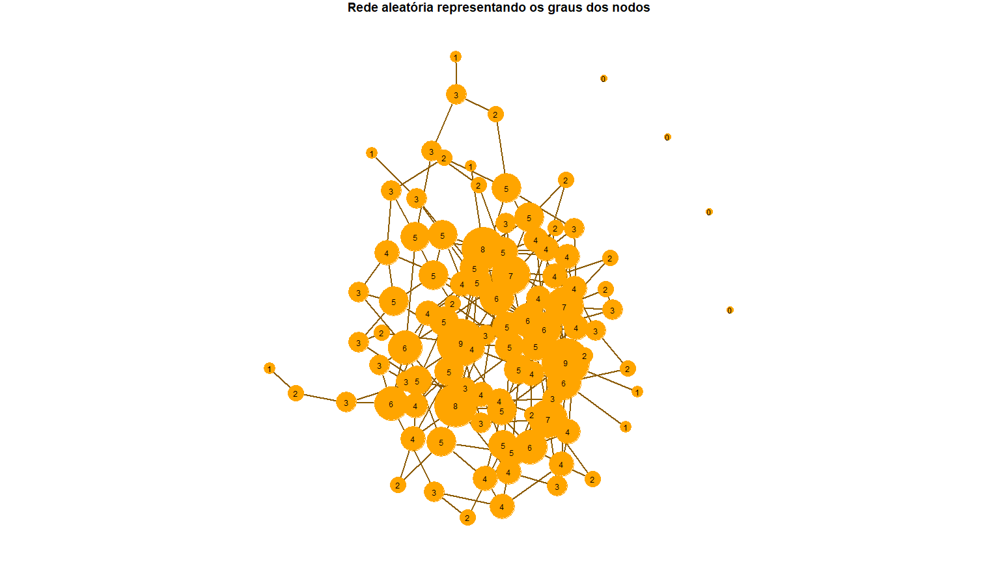
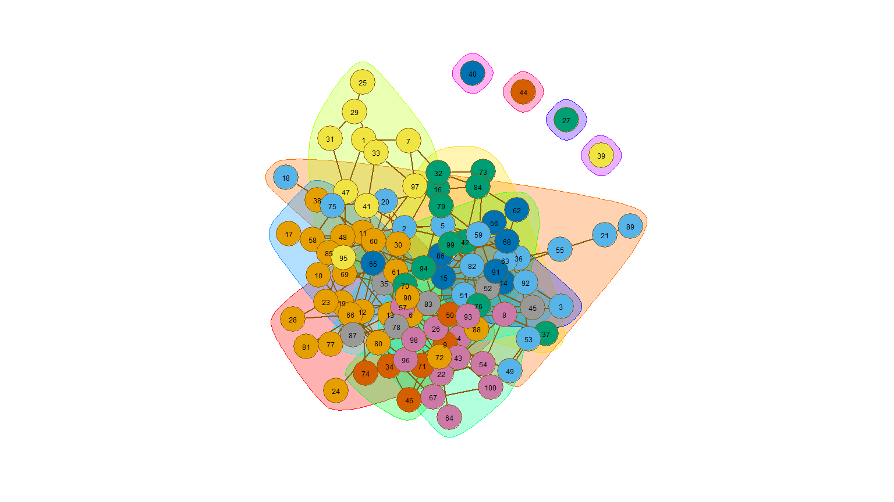
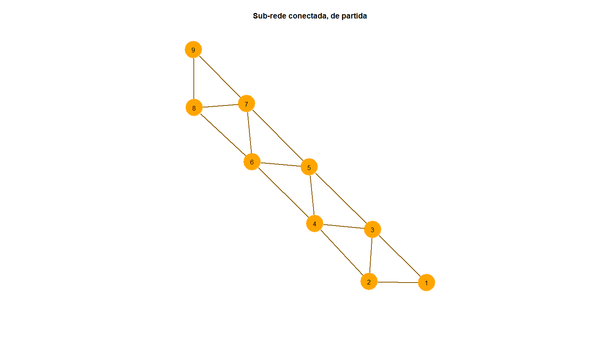
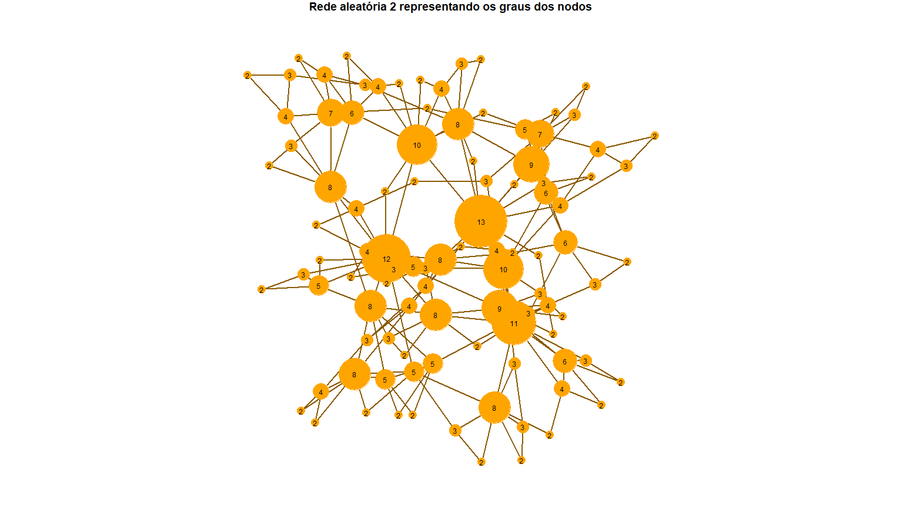
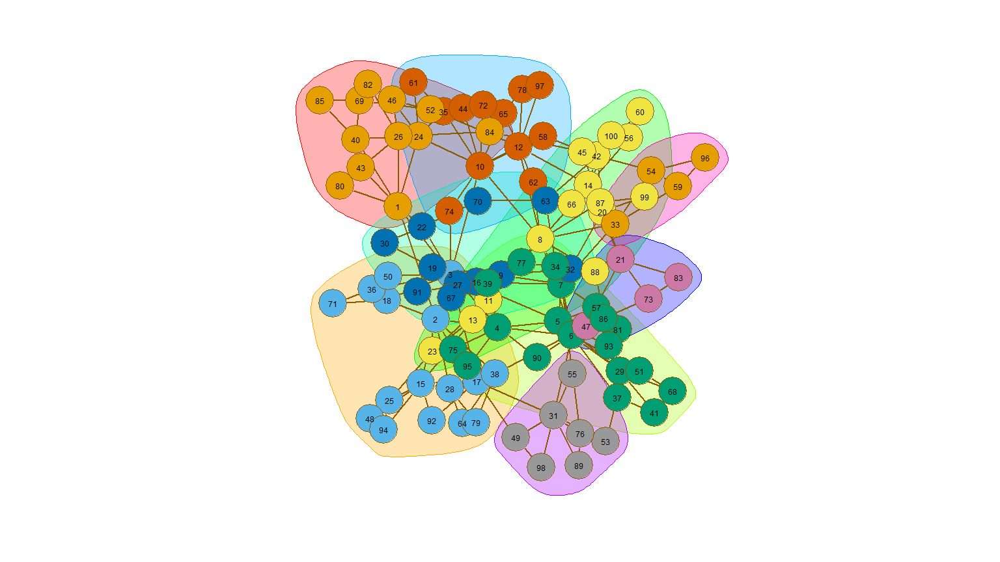
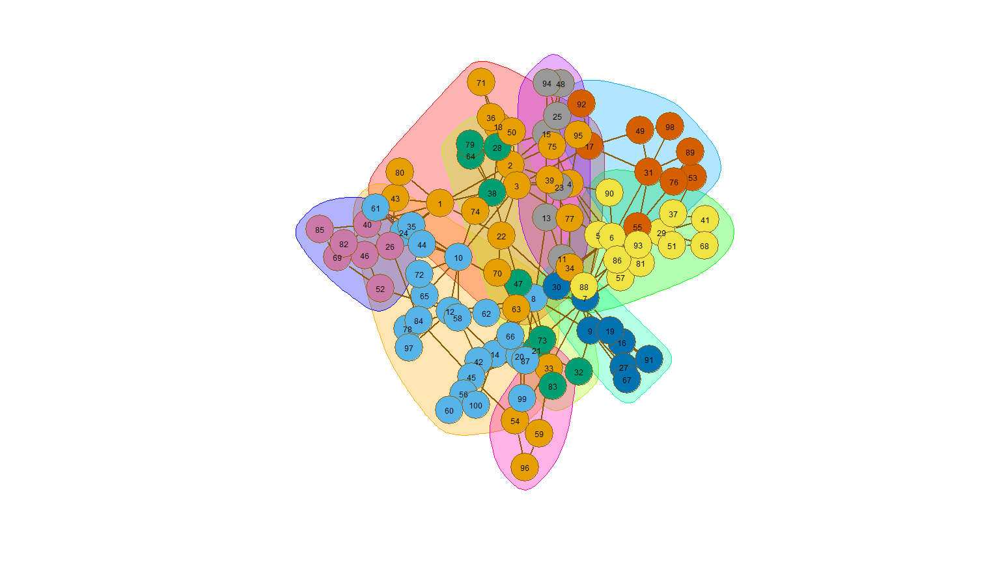

<style type="text/css">
#header {
  background-image: url("rgb_iscte_pt_horizontal_positive.png");
  background-size: 300px;
  background-repeat: no-repeat;
  background-position: 0px 0px;
  padding-top: 95px;
}
#header > * {
  max-width: calc(100% - 225px);
}
#header > *
  max-width: 100%;
}
</style>


\newpage

# Introdução

Este trabalho leva-nos a estudar duas redes aleatórias, aparentemente com características de base comuns (grau médio e número de nodos), mas que fruto dos diferentes algoritmos de geração de cada rede, manifestam características intrínsecas diferentes, nomeadamente no que toca à existência de comunidades.


# QUESTÃO 1:

> Suponha que pretende gerar uma rede aleatória não orientada com 100 nodos e grau médio aproximadamente igual a 4. Qual deve ser a probabilidade utilizada na geração da rede?
> Gere esta rede.

O grau médio seria de aproximadamente 100, se todos os nodos estivessem ligados entre si. Neste caso teremos uma probabilidade de 4% - que cada nodo esteja ligado apenas a 4 dos 100 nodos.

É possível determinar o grau médio de uma rede conhecendo o número de nodos e a probabilidade de geração utilizada:

$\langle k\rangle = p(N-1)$

Isto significa que, resolvendo a equação em função de p, temos:

$p = \langle k\rangle / (N-1)$

No nosso caso concreto, o objectivo é obtermos $\langle k\rangle = 4$, tendo $N=100$. Logo, a probabilidade que deverá ser usada na geração da rede aleatória é:

$p = 4/(100-1) \Leftrightarrow p = 4/99 = 0.04 \text{ (aprox.)}$

Ou seja, para obtermos uma rede aletória de 100 nodos e um grau médio de 4, deveremos usar uma probabilidade de 4% na geração das suas ligações.


```r
set.seed(42)
graph1 <- sample_gnp(100, 0.04)
degrees <- degree(graph1, mode="all")
par(mar=c(0,0,1,0))
# Gráfico com grau
plot(graph1,  vertex.size=3+degrees*2, edge.color="orange4"
     , edge.width=2
     , vertex.label=degrees
     , vertex.label.cex=0.75
     , vertex.label.color="black"
     , vertex.label.family="sans"
     , vertex.frame.color="orange"
     , vertex.color = "orange"
     , main="Rede aleatória representando os graus dos nodos"
     )
```

<!-- -->

> Caracterize esta rede quanto ao grau médio dos nodos, à conectividade, distância média e existência de triângulos. Aplique ainda métodos de identificação de comunidades.

## Grau Médio


```r
# grau médio
mean(degree(graph1))
```

```
## [1] 3.76
```

O grau médio é próximo de 4, tal como esperaríamos.

## Conectividade


```r
# Conectividade
degree(graph1)
```

```
##   [1] 2 5 2 4 4 5 3 5 5 4 5 6 6 3 9 5 2 1 4 5 2 6 4 1 1 5 0 2 3 4 2 4 3 4 7 6 1
##  [38] 1 0 0 2 4 5 0 2 3 5 4 2 4 8 3 3 4 3 2 5 3 6 8 6 3 4 2 5 7 4 3 3 2 4 7 3 2
##  [75] 3 6 3 4 2 9 2 5 4 5 5 5 2 3 1 3 5 4 3 5 4 3 5 4 5 4
```

Vemos que existem 4 nodos com grau zero, o que indica que não têm qualquer ligação. Neste caso estamos perante uma rede desconexa.

## Componentes


```r
components(graph1)
```

```
## $membership
##   [1] 1 1 1 1 1 1 1 1 1 1 1 1 1 1 1 1 1 1 1 1 1 1 1 1 1 1 2 1 1 1 1 1 1 1 1 1 1
##  [38] 1 3 4 1 1 1 5 1 1 1 1 1 1 1 1 1 1 1 1 1 1 1 1 1 1 1 1 1 1 1 1 1 1 1 1 1 1
##  [75] 1 1 1 1 1 1 1 1 1 1 1 1 1 1 1 1 1 1 1 1 1 1 1 1 1 1
## 
## $csize
## [1] 96  1  1  1  1
## 
## $no
## [1] 5
```

Portanto, existem 4 nodos isolados e uma componente gigante.

## Associação


```r
# Associação de grau
assortativity_degree(graph1) 
```

```
## [1] -0.08082738
```

É negativo mas muito próximo de zero, por isso não é um rede associativa mas também não se pode concluir que é Não associativa.

Vamos olhar agora para o método de medição da associação de grau com base no grau médio dos nodos adjacentes:


```r
knn(graph1)$knnk
```

```
## [1] 5.166667 4.781250 4.666667 4.952381 4.740000 4.428571 4.095238 4.812500
## [9] 4.277778
```

A função tem uma tendência decrescente, mas não estritamente decrescente, oscilando. Por isso mantemos que não é uma rede associativa mas também não pode ser classificada como não associativa.

## Distância média


```r
# distância média
mean_distance(graph1)
```

```
## [1] 3.474123
```

```r
log10(100)
```

```
## [1] 2
```

```r
#diâmetro
diameter(graph1)
```

```
## [1] 8
```

A distância média é grande, já que se afasta substancialmente de $log10(N)$.

A maior distância entre nodos (conectados) é de 8.

## Existência de triângulos


```r
# Coeficiente de clustering
transitivity(graph1, type="global")
```

```
## [1] 0.03453237
```

É um número baixo de triângulos, já que o coeficiente de *clustering* é um rácio entre o número de triângulos e o número total de ternos conexos e este é baixo.

## Identificação de comunidades

Usando o método do corte mínimo:


```r
min_cut(graph1, value.only = F)
```

```
## $value
## [1] 0
## 
## $cut
## + 0/188 edges from 95190d4:
## 
## $partition1
## + 96/100 vertices, from 95190d4:
##  [1]   1   2   3   4   5   6   7   8   9  10  11  12  13  14  15  16  17  18  19
## [20]  20  21  22  23  24  25  26  28  29  30  31  32  33  34  35  36  37  38  41
## [39]  42  43  45  46  47  48  49  50  51  52  53  54  55  56  57  58  59  60  61
## [58]  62  63  64  65  66  67  68  69  70  71  72  73  74  75  76  77  78  79  80
## [77]  81  82  83  84  85  86  87  88  89  90  91  92  93  94  95  96  97  98  99
## [96] 100
## 
## $partition2
## + 4/100 vertices, from 95190d4:
## [1] 27 39 40 44
```

Temos um conjunto com os nodos ligados (a componente gigante) e um outro com os nodos isolados. Com um corte de dimensão zero.

Usando o método das cliques:


```r
sapply(cliques(graph1),length)
```

```
##   [1] 1 1 1 1 1 1 1 1 1 1 1 1 1 1 1 1 1 1 1 1 1 1 1 1 1 1 1 1 1 1 1 1 1 1 1 1 2
##  [38] 1 2 1 2 2 1 2 1 2 2 2 1 2 2 2 2 1 2 1 2 1 2 2 1 2 1 2 1 2 2 2 2 1 2 2 1 2
##  [75] 1 2 2 2 1 2 2 2 1 2 2 1 2 1 2 1 2 2 2 1 2 2 1 2 2 2 1 2 2 1 2 1 2 1 2 1 2
## [112] 2 2 1 2 2 1 2 2 2 1 2 2 2 2 1 2 2 2 2 2 1 2 2 1 2 1 2 1 2 2 2 2 2 1 2 2 1
## [149] 2 3 2 2 2 1 2 2 2 2 2 1 2 2 2 2 2 1 2 2 2 2 1 2 2 2 1 2 2 3 2 1 2 2 2 2 1
## [186] 2 3 2 2 1 2 2 1 2 2 3 2 2 2 2 2 2 1 2 2 2 1 2 2 1 2 2 2 1 2 2 1 2 2 2 2 1
## [223] 2 2 2 2 1 2 2 2 1 2 2 2 2 2 1 2 2 2 2 1 2 2 2 1 2 2 2 2 2 2 1 2 2 2 2 1 2
## [260] 2 2 1 2 2 3 2 2 1 2 2 2 2 1 2 2 1 2 3 2 2 2 1 2 2 2 2 2 2 1 2 2 3 2 3 2 2
```

As cliques parecem fazer divisões muito pequenas, de 1, 2 ou 3 nodos. Sendo que as maiores cliques têm 3 nodos. O número excessivo de comunidades é um dos problemas conhecidos deste algoritmo.


```r
largest_cliques(graph1)
```

```
## [[1]]
## + 3/100 vertices, from 95190d4:
## [1] 92 82 63
## 
## [[2]]
## + 3/100 vertices, from 95190d4:
## [1] 92 82 51
## 
## [[3]]
## + 3/100 vertices, from 95190d4:
## [1] 85 61 69
## 
## [[4]]
## + 3/100 vertices, from 95190d4:
## [1] 85 61 60
## 
## [[5]]
## + 3/100 vertices, from 95190d4:
## [1] 84 32 73
## 
## [[6]]
## + 3/100 vertices, from 95190d4:
## [1] 80  6 66
## 
## [[7]]
## + 3/100 vertices, from 95190d4:
## [1] 76  6 72
## 
## [[8]]
## + 3/100 vertices, from 95190d4:
## [1] 59  5 36
```

Função que mostra dados sobre *clusters*:

```r
show.cluster <- function(g1, cl) {
  plot(cl, g1
          , edge.color="orange4"
          , edge.width=2
          , vertex.label.cex=0.75
          , vertex.label.color="black"
          , vertex.label.family="sans"
          , vertex.frame.color="orange4"
          )
  print(c("Número de clusters:", length(cl)))
  print("Tamanho dos clusters:")
  print(sizes(cl))
  print(c("modularidade:", modularity(cl)))
  print("Pertença a clusters:")
  membership(cl)
}
```

Verificando o método de *clustering* pela remoção de pontes:


```r
show.cluster(graph1, cluster_edge_betweenness(graph1))
```

<!-- -->

```
## [1] "Número de clusters:" "15"                 
## [1] "Tamanho dos clusters:"
## Community sizes
##  1  2  3  4  5  6  7  8  9 10 11 12 13 14 15 
## 20 14 11  9  5 16  8  2  2  5  1  1  1  1  4 
## [1] "modularidade:"     "0.473276935264826"
## [1] "Pertença a clusters:"
```

```
##   [1]  1  1  2  2  1  3  1  2  4  1  1  3  5  6  6  1  7  8  4  1  9  2  3  3 10
##  [26]  2 11  3 10  1 10  1 10  4  6  1  7  1 12 13 10  1  2 14  7  4  1  7  4  4
##  [51]  6  6  4  2 15 15  2  7  1  1  5 15  6  2  3  3  2  6  5  3  4  2  1  4  8
##  [76]  7  3  6  7  3  3  6  6  1  5  6  6  6  9  6 15  6  5  7  1  2  1  2  6  2
```

Usando o método de *clustering* pela propagação de etiquetas:


```r
set.seed(42)
show.cluster(graph1, cluster_label_prop(graph1))
```

<!-- -->

```
## [1] "Número de clusters:" "10"                 
## [1] "Tamanho dos clusters:"
## Community sizes
##  1  2  3  4  5  6  7  8  9 10 
## 16 18 45 11  5  1  1  1  1  1 
## [1] "modularidade:"     "0.391381846989588"
## [1] "Pertença a clusters:"
```

```
##   [1]  1  1  2  3  1  3  1  2  3  3  4  2  4  2  2  1  4  2  3  1  3  3  3  3  5
##  [26]  2  6  3  5  1  5  1  5  3  3  1  3  4  7  8  5  1  3  9  3  3 10  3  1  3
##  [51]  2  3  1  2  3  2  3  3  1  4  4  3  2  3  2  3  3  3  4  3  3  3  1  3  2
##  [76]  3  4  3  3  3  4  2  3  1  4  3  3  2  3  2  3  2  2  3  4  3  1  3  3  3
```

Usámos o `set.seed(42)` para estabilizar numa mesma solução, para análise.

Usando o método da otimização de modularidade:


```r
show.cluster(graph1, cluster_fast_greedy(graph1))
```

<!-- -->

```
## [1] "Número de clusters:" "14"                 
## [1] "Tamanho dos clusters:"
## Community sizes
##  1  2  3  4  5  6  7  8  9 10 11 12 13 14 
## 13 12 11 10  8  6 13  6 12  5  1  1  1  1 
## [1] "modularidade:"     "0.473970122227252"
## [1] "Pertença a clusters:"
```

```
##   [1]  4  2 10  7  2  1  4  7  6  9  9  1  1  5  5  3  9  2  9  2  2  7  1  1  4
##  [26]  7 11  1  4  1  4  3  4  6  8  2  3  9 12 13  4  3  7 14  8  6  4  9  2  6
##  [51] 10  8  2  7  2  5  7  9  2  9  9  5 10  7  5  9  7  5  9  3  6  1  3  6  2
##  [76]  3  1  8  3  1  1 10  8  3  9  5  8  1  2  1  5 10  7  3  4  7  4  7  3  7
```

# QUESTÃO 2:

> Utilize o programa seguinte para gerar a rede aleatória rn2:


```r
set.seed(42)
rn2 <- graph(edge=c(1,2,1,3,2,3,3,4,3,5,4,5,5,6,5,7,6,7,7,8,7,9,8,9,2,4,4,6,6,8)
             ,n=100
             ,directed=F);
x = 9;
y = 15;
for (i in 1:91) {
  new <- floor(runif(1,min=1,max=x));
  nn <- neighbors(rn2,new);
  x = x+1;
  y = y+1;
  rn2 <- add_edges(rn2,c(new,x));
  newr <- runif(1);
  y = y+1;
  if (newr < 0.75) {
    new1 <- floor(runif(1,min=1,max=degree(rn2,new,mode="all")));
    rn2 <- add_edges(rn2,c(x,nn[new1]))}
  else {
    new2 <- new; 
    while (new==new2) new2<-floor(runif(1,min=1,max=x-1));
    rn2 <- add_edges(rn2,c(new2,x))};
}
```

> Qual o método utilizado nesta geração? Justifique.

O método utilizado nesta geração é o Modelo do Passeio Aleatório. Neste método, começamos a criação de uma rede aleatória a partir de uma pequena sub-rede - no programa temos uma subrede conexa composta por 9 nodos, com a representação abaixo:


```r
set.seed(42)
plot(graph(edge=c(1,2,1,3,2,3,3,4,3,5,4,5,5,6,5,7,6,7,7,8,7,9,8,9,2,4,4,6,6,8),directed=F)
     , edge.color="orange4"
     , edge.width=2
     , vertex.label.color="black"
     , vertex.label.family="sans"
     , vertex.frame.color="orange"
     , vertex.color = "orange"
     , main="Sub-rede conectada, de partida")
```

<!-- -->

Na prática, a rede gerada pelo programa contém já os 100 nodos que se pretende utilizar, mas os restantes 91 não têm, na fase inicial, ainda qualquer ligação. Com a construção da rede aleatória eles serão iterativamente adicionados. Em cada iteração, ou seja, por cada um dos 91 nodos que serão adicionados à subrede conexa já existente, temos:

-   o método selecciona aleatoriamente a partir de uma distribuição uniforme um dos nodos da subrede ("new"), e identifica quais os respectivos nodos adjacentes. Cria entretanto uma ligação entre o nodo seleccionado e o próximo a ser integrado na sub-rede (ou seja, um nodo do subconjunto que têm grau zero; na primeira iteração, por exemplo, cria uma nova ligação entre o nodo 10 e um dos da subrede conexa);

-   é gerado um número aleatório que dita uma probabilidade (p = 0.75 e q = 0.25), que é usada da seguinte forma:

    -   se obtivermos p (com probabilidade de 75%), então é criada mais uma ligação entre o novo nodo e um dos adjacentes de "new" (já identificado no início da iteração) - criando um triângulo;

    -   se obtivermos q (1-p), então é criada mais uma ligação entre o novo nodo e um dos já pertencentes à subrede conexa, seleccionado aleatoriamente a partir de uma distribuição uniforme;

Este método termina quando todos os 91 nodos tiverem sido adicionados à rede através da criação das ligações.

Este é um método de geração de redes aleatórias que não escolhe os nodos adjacentes com base no seu grau. Esta escolha é aleatória.

> Caracterize esta rede quanto ao grau médio dos nodos, à conectividade, distância média e existência de triângulos. Aplique ainda métodos de identificação de comunidades.


```r
set.seed(42)
degrees <- degree(rn2, mode="all")
par(mar=c(0,0,1,0))
# Gráfico com grau
plot(rn2,  vertex.size=degrees*2, edge.color="orange4"
     , edge.width=2
     , vertex.label=degrees
     , vertex.label.cex=0.75
     , vertex.label.color="black"
     , vertex.label.family="sans"
     , vertex.frame.color="orange"
     , vertex.color = "orange"
     , main="Rede aleatória 2 representando os graus dos nodos"
     )
```

<!-- -->

## Grau Médio


```r
# Grau médio
mean(degree(rn2))
```

```
## [1] 3.94
```

O grau médio é próximo de 4, em semelhança à primeira rede.

## Conectividade


```r
# Conectividade
degree(rn2)
```

```
##   [1]  8  8 12  8  9 11 10 13  8 10  4  8  4  9  8  5  5  5  4  6  6  4  3  6  4
##  [26]  7  3  5  6  2  8  2  4  4  4  3  4  5  3  4  2  7  3  2  5  4  3  2  3  2
##  [51]  3  3  2  4  3  3  3  2  3  2  2  2  3  2  4  2  2  2  3  2  2  2  3  2  3
##  [76]  3  2  3  2  2  2  2  2  2  2  4  3  2  2  2  2  2  2  2  2  2  2  2  2  2
```

Não existem nodos com grau igual a 0.

## Componentes


```r
components(rn2)
```

```
## $membership
##   [1] 1 1 1 1 1 1 1 1 1 1 1 1 1 1 1 1 1 1 1 1 1 1 1 1 1 1 1 1 1 1 1 1 1 1 1 1 1
##  [38] 1 1 1 1 1 1 1 1 1 1 1 1 1 1 1 1 1 1 1 1 1 1 1 1 1 1 1 1 1 1 1 1 1 1 1 1 1
##  [75] 1 1 1 1 1 1 1 1 1 1 1 1 1 1 1 1 1 1 1 1 1 1 1 1 1 1
## 
## $csize
## [1] 100
## 
## $no
## [1] 1
```

Só existe uma componente, o que quer dizer que existe um caminho entre qualquer par de nodos da rede. Neste caso estamos perante uma rede conexa.

## Associação


```r
# Associação de grau
assortativity_degree(rn2) 
```

```
## [1] 0.004358032
```

É muito próximo de zero, por isso não é um rede associativa mas também não se pode concluir que é Não associativa.


```r
knn(rn2)$knnk
```

```
##  [1]      NaN 6.050000 5.333333 5.500000 5.100000 5.416667 4.214286 5.392857
##  [9] 6.000000 6.050000 6.454545 5.583333 5.923077
```

De igual forma, usando o método de medição da associação de grau com base no grau médio dos nodos adjacentes, mantemos a mesma conclusão.

## Distância média


```r
# Distância média
mean_distance(rn2)
```

```
## [1] 3.675758
```

```r
log10(100)
```

```
## [1] 2
```

```r
# Diâmetro
diameter(rn2)
```

```
## [1] 7
```

A distância média é grande, já que se afasta substancialmente de $log10(N)$.

A maior distância entre nodos (conectados) é de 7.


## Existência de triângulos


```r
# Existência de triângulos
transitivity(rn2, type = "global")
```

```
## [1] 0.2491694
```

O rácio é bastante superior a zero, embora não se aproxime de 1 - revela a existência de bastantes triângulos.

## Identificação de comunidades

Usando o método do corte mínimo:


```r
set.seed(42)
min_cut(rn2, value.only = F)
```

```
## $value
## [1] 2
## 
## $cut
## + 2/197 edges from 9790834:
## [1] 37--53 31--53
## 
## $partition1
## + 1/100 vertex, from 9790834:
## [1] 53
## 
## $partition2
## + 99/100 vertices, from 9790834:
##  [1]   1   2   3   4   5   6   7   8   9  10  11  12  13  14  15  16  17  18  19
## [20]  20  21  22  23  24  25  26  27  28  29  30  31  32  33  34  35  36  37  38
## [39]  39  40  41  42  43  44  45  46  47  48  49  50  51  52  54  55  56  57  58
## [58]  59  60  61  62  63  64  65  66  67  68  69  70  71  72  73  74  75  76  77
## [77]  78  79  80  81  82  83  84  85  86  87  88  89  90  91  92  93  94  95  96
## [96]  97  98  99 100
```

Mais uma vez, este método separa a rede em dois com dimensão dois - uma componente gigante e um nodo isolado.

Usando o método das cliques:


```r
sapply(cliques(rn2),length)
```

```
##   [1] 1 1 1 1 1 1 1 1 1 1 1 1 1 1 1 1 1 1 1 1 1 1 1 1 1 1 1 1 1 2 2 2 2 1 2 2 2
##  [38] 2 1 2 2 2 2 1 2 2 2 1 2 2 2 1 2 1 2 1 2 2 1 2 2 1 2 1 2 1 2 1 2 1 2 1 2 2
##  [75] 2 1 2 2 1 2 2 1 2 2 1 2 1 2 1 2 1 2 1 2 2 1 2 1 2 1 2 1 2 1 2 1 2 2 1 2 2
## [112] 1 2 2 2 1 2 2 1 2 3 2 3 2 3 2 3 3 2 2 2 2 2 2 1 2 3 2 1 2 3 2 1 2 3 2 1 2
## [149] 3 2 1 2 3 2 1 2 3 2 1 2 3 2 2 1 2 2 1 2 3 2 1 2 3 2 1 2 3 2 1 2 3 2 1 2 3
## [186] 2 1 2 3 2 1 2 3 2 1 2 3 2 1 2 2 1 2 3 2 3 2 1 2 3 2 2 1 2 2 1 2 3 2 1 2 3
## [223] 2 1 2 3 2 2 1 2 3 2 1 2 3 3 2 2 1 2 3 2 1 2 3 2 3 2 2 1 2 2 3 2 1 2 3 3 2
## [260] 2 1 2 3 2 3 2 2 1 2 3 2 3 2 3 2 3 2 2 1 2 3 2 2 2 1 2 3 2 3 3 2 2 2 2 1 2
## [297] 3 2 3 2 2 2 1 2 3 3 2 2 2 1 2 3 3 2 2 3 2 3 2 3 3 2 2 2 1 2 3 2 3 3 2 3 2
## [334] 3 3 2 2 2 2 1 2 2 3 2 3 3 2 3 2 3 3 2 2 2 1 2 3 3 3 3 2 3 2 3 2 3 2 3 2 2
## [371] 2 2
```

As cliques parecem fazer divisões muito pequenas, de 1, 2 ou 3 nodos. Sendo que as maiores cliques têm 3 nodos. O número excessivo de comunidades é um problema conhecido deste algoritmo.


```r
largest_cliques(rn2)
```

```
## [[1]]
## + 3/100 vertices, from 9790834:
## [1] 98 31 49
## 
## [[2]]
## + 3/100 vertices, from 9790834:
## [1] 97 12 78
## 
## [[3]]
## + 3/100 vertices, from 9790834:
## [1] 96 54 59
## 
## [[4]]
## + 3/100 vertices, from 9790834:
## [1] 95  4 75
## 
## [[5]]
## + 3/100 vertices, from 9790834:
## [1] 94 15 25
## 
## [[6]]
## + 3/100 vertices, from 9790834:
## [1] 93  5 86
## 
## [[7]]
## + 3/100 vertices, from 9790834:
## [1] 92 15 17
## 
## [[8]]
## + 3/100 vertices, from 9790834:
## [1] 91 16 19
## 
## [[9]]
## + 3/100 vertices, from 9790834:
## [1] 90  4  6
## 
## [[10]]
## + 3/100 vertices, from 9790834:
## [1] 89 31 76
## 
## [[11]]
## + 3/100 vertices, from 9790834:
## [1] 86  5  6
## 
## [[12]]
## + 3/100 vertices, from 9790834:
## [1] 85 40 69
## 
## [[13]]
## + 3/100 vertices, from 9790834:
## [1] 83 21 73
## 
## [[14]]
## + 3/100 vertices, from 9790834:
## [1] 82 26 46
## 
## [[15]]
## + 3/100 vertices, from 9790834:
## [1] 81  5 57
## 
## [[16]]
## + 3/100 vertices, from 9790834:
## [1] 80  1 43
## 
## [[17]]
## + 3/100 vertices, from 9790834:
## [1] 79 28 38
## 
## [[18]]
## + 3/100 vertices, from 9790834:
## [1] 78 12 65
## 
## [[19]]
## + 3/100 vertices, from 9790834:
## [1] 76 31 55
## 
## [[20]]
## + 3/100 vertices, from 9790834:
## [1] 75  2  4
## 
## [[21]]
## + 3/100 vertices, from 9790834:
## [1] 74  3 10
## 
## [[22]]
## + 3/100 vertices, from 9790834:
## [1] 73 21 47
## 
## [[23]]
## + 3/100 vertices, from 9790834:
## [1] 72 10 65
## 
## [[24]]
## + 3/100 vertices, from 9790834:
## [1] 71 18 36
## 
## [[25]]
## + 3/100 vertices, from 9790834:
## [1] 68 29 51
## 
## [[26]]
## + 3/100 vertices, from 9790834:
## [1] 67  9 27
## 
## [[27]]
## + 3/100 vertices, from 9790834:
## [1] 65 10 12
## 
## [[28]]
## + 3/100 vertices, from 9790834:
## [1] 64 28 38
## 
## [[29]]
## + 3/100 vertices, from 9790834:
## [1] 61 24 35
## 
## [[30]]
## + 3/100 vertices, from 9790834:
## [1] 60 42 56
## 
## [[31]]
## + 3/100 vertices, from 9790834:
## [1] 59 33 54
## 
## [[32]]
## + 3/100 vertices, from 9790834:
## [1] 57  5  7
## 
## [[33]]
## + 3/100 vertices, from 9790834:
## [1] 56 14 42
## 
## [[34]]
## + 3/100 vertices, from 9790834:
## [1] 51  6 29
## 
## [[35]]
## + 3/100 vertices, from 9790834:
## [1] 50  3 18
## 
## [[36]]
## + 3/100 vertices, from 9790834:
## [1] 49 17 31
## 
## [[37]]
## + 3/100 vertices, from 9790834:
## [1] 48 15 25
## 
## [[38]]
## + 3/100 vertices, from 9790834:
## [1] 46 24 26
## 
## [[39]]
## + 3/100 vertices, from 9790834:
## [1] 45 20 42
## 
## [[40]]
## + 3/100 vertices, from 9790834:
## [1] 44 10 35
## 
## [[41]]
## + 3/100 vertices, from 9790834:
## [1] 43  1 26
## 
## [[42]]
## + 3/100 vertices, from 9790834:
## [1] 42 14 20
## 
## [[43]]
## + 3/100 vertices, from 9790834:
## [1] 41 29 37
## 
## [[44]]
## + 3/100 vertices, from 9790834:
## [1] 40  1 26
## 
## [[45]]
## + 3/100 vertices, from 9790834:
## [1] 39  3  4
## 
## [[46]]
## + 3/100 vertices, from 9790834:
## [1] 38  2 28
## 
## [[47]]
## + 3/100 vertices, from 9790834:
## [1] 37  6 29
## 
## [[48]]
## + 3/100 vertices, from 9790834:
## [1] 36  3 18
## 
## [[49]]
## + 3/100 vertices, from 9790834:
## [1] 35 10 24
## 
## [[50]]
## + 3/100 vertices, from 9790834:
## [1] 34  6  7
## 
## [[51]]
## + 3/100 vertices, from 9790834:
## [1] 29  5  6
## 
## [[52]]
## + 3/100 vertices, from 9790834:
## [1] 28  2 15
## 
## [[53]]
## + 3/100 vertices, from 9790834:
## [1] 27  9 16
## 
## [[54]]
## + 3/100 vertices, from 9790834:
## [1] 26  1 24
## 
## [[55]]
## + 3/100 vertices, from 9790834:
## [1] 23 11 13
## 
## [[56]]
## + 3/100 vertices, from 9790834:
## [1] 22  1  3
## 
## [[57]]
## + 3/100 vertices, from 9790834:
## [1] 21 14 20
## 
## [[58]]
## + 3/100 vertices, from 9790834:
## [1] 19  9 16
## 
## [[59]]
## + 3/100 vertices, from 9790834:
## [1] 18  2  3
## 
## [[60]]
## + 3/100 vertices, from 9790834:
## [1] 16  7  9
## 
## [[61]]
## + 3/100 vertices, from 9790834:
## [1]  8 87 14
## 
## [[62]]
## + 3/100 vertices, from 9790834:
## [1]  8 66 14
## 
## [[63]]
## + 3/100 vertices, from 9790834:
## [1]  8 62 12
## 
## [[64]]
## + 3/100 vertices, from 9790834:
## [1]  8 14 12
## 
## [[65]]
## + 3/100 vertices, from 9790834:
## [1]  8 13 11
## 
## [[66]]
## + 3/100 vertices, from 9790834:
## [1]  8 12 10
## 
## [[67]]
## + 3/100 vertices, from 9790834:
## [1]  8 11  9
## 
## [[68]]
## + 3/100 vertices, from 9790834:
## [1]  8  7 33
## 
## [[69]]
## + 3/100 vertices, from 9790834:
## [1] 8 7 9
## 
## [[70]]
## + 3/100 vertices, from 9790834:
## [1] 8 7 6
## 
## [[71]]
## + 3/100 vertices, from 9790834:
## [1] 5 7 6
## 
## [[72]]
## + 3/100 vertices, from 9790834:
## [1] 5 4 6
## 
## [[73]]
## + 3/100 vertices, from 9790834:
## [1] 5 4 3
## 
## [[74]]
## + 3/100 vertices, from 9790834:
## [1] 4 2 3
## 
## [[75]]
## + 3/100 vertices, from 9790834:
## [1] 3 1 2
```

Verificando o método da remoção de pontes:


```r
show.cluster(rn2, cluster_edge_betweenness(rn2))
```

<!-- -->

```
## [1] "Número de clusters:" "9"                  
## [1] "Tamanho dos clusters:"
## Community sizes
##  1  2  3  4  5  6  7  8  9 
## 12 16 19 15 11 12  4  7  4 
## [1] "modularidade:"     "0.628552655311912"
## [1] "Pertença a clusters:"
```

```
##   [1] 1 2 2 3 3 3 3 4 5 6 4 6 4 4 2 5 2 2 5 4 7 5 4 1 2 1 5 2 3 5 8 5 9 3 6 2 3
##  [38] 2 3 1 3 4 1 6 4 1 7 2 8 2 3 1 8 9 8 4 3 6 9 4 6 6 5 2 6 4 5 3 1 5 2 6 7 6
##  [75] 3 8 3 6 2 1 3 1 7 1 1 3 4 4 8 3 5 2 3 2 3 9 6 8 4 4
```

Usando o método de propagação de etiquetas:


```r
set.seed(42)
show.cluster(rn2, cluster_label_prop(rn2))
```

<!-- -->

```
## [1] "Número de clusters:" "9"                  
## [1] "Tamanho dos clusters:"
## Community sizes
##  1  2  3  4  5  6  7  8  9 
## 31 33  7  3  5  8  5  4  4 
## [1] "modularidade:"     "0.564521116235925"
## [1] "Pertença a clusters:"
```

```
##   [1] 1 1 1 1 1 1 1 2 3 2 4 2 4 2 5 3 6 1 3 2 7 1 4 2 5 2 3 8 1 3 6 7 9 1 2 1 1
##  [38] 8 1 2 1 2 1 2 2 2 7 5 6 1 1 2 6 9 6 2 1 2 9 2 2 2 1 8 2 2 3 1 2 1 1 2 7 2
##  [75] 1 6 1 2 8 1 1 2 7 2 2 1 2 2 6 1 3 5 1 5 1 9 2 6 2 2
```

Usámos o `set.seed(42)` para estabilizar numa mesma solução, para análise.

Usando o método da otimização de modularidade:


```r
show.cluster(rn2, cluster_fast_greedy(rn2))
```

<!-- -->

```
## [1] "Número de clusters:" "9"                  
## [1] "Tamanho dos clusters:"
## Community sizes
##  1  2  3  4  5  6  7  8  9 
## 19 24  9 13  8  9  7  7  4 
## [1] "modularidade:"     "0.616867221520782"
## [1] "Pertença a clusters:"
```

```
##   [1] 1 1 1 1 4 4 5 2 5 2 8 2 8 2 8 5 6 1 5 2 3 1 8 2 8 7 5 3 4 5 6 3 9 1 2 1 4
##  [38] 3 1 7 4 2 1 2 2 7 3 8 6 1 4 7 6 9 6 2 4 2 9 2 2 2 1 3 2 2 5 4 7 1 1 2 3 1
##  [75] 1 6 1 2 3 1 4 7 3 2 7 4 2 4 6 4 5 6 4 8 1 9 2 6 2 2
```

# QUESTÃO 3:

> Compare e comente os resultados obtidos nas questões anteriores.

+----------+------------+---------------+-------------+------------+-----------------+----------+---------------------------+
| Rede     | Grau Médio | Conectividade | Componentes | Associação | Distância Média | Diâmetro | Coeficiente de clustering |
+==========+============+===============+=============+============+=================+==========+===========================+
| Rede \#1 | 3.76       | Rede Desconexa| 5           | -0.08082738| 3.474123        | 8        | 0.03453237                |
+----------+------------+---------------+-------------+------------+-----------------+----------+---------------------------+
| Rede \#2 | 3.94       | Rede Conexa   | 1           | 0.004358032| 3.675758        | 7        | 0.2491694                 |
+----------+------------+---------------+-------------+------------+-----------------+----------+---------------------------+

  Tab. 1: Tabela de comparação de valores da caracterização das Redes #1 e #2


Ao olharmos para a caracterização de cada rede é possível constatar, que são duas redes distintas no que toca à conectividade, uma é desconexa (Rede #1) e a outra é conexa (Rede #2). 

Ambas têm um grau médio semelhante, próximo de 4. O que quer dizer que a maioria dos nodos da Rede #1 e da Rede #2 têm grau 4.

Na Rede #1 observámos que haviam 4 nodos com grau 0, o que indica que não têm qualquer ligação, por isso concluímos que a rede é desconexa; O mesmo não se verifica na Rede #2, que concluímos ser conexa, uma vez que só tem um componente, ou seja, existe um caminho entre qualquer par de nodos da rede.

Quanto às componentes, verificámos que a Rede #1 era a que tinha mais (5 componentes: 4 nodos isolados e 1 componente gigante composta por 96 nodos); A Rede #2 tinha apenas 1 componente que era composta por todos os nodos da rede.

A associação de grau de ambas as redes é muito próxima de 0, por isso concluímos que não eram redes associativas (não podemos concluir que é uma rede não associativa apenas com base nestes valores).

A distância média das duas redes é grande, pois este valor afasta-se substancialmente de $log10(N) = log10(100) = 2$ (o número de nodos de ambas as redes é 100). Na Rede #1 a maior distância entre nodos conectados é 8 e na Rede #2 essa distância é 7. A rede com a maior diâmetro é a Rede #1.

Recorrendo ao coeficiente de *clustering* (rácio entre o número de triângulos e o número total de ternos conexos), percebemos que as duas redes apresentam a existência de triângulos. O rácio da Rede #2 é bastante superior a 0, o que revela a existência de uma quantidade considerável de triângulos. Já a Rede #1 revela um número baixo de triângulos, uma vez que o seu coeficiente de *clustering* é baixo (está muito próximo de 0).

Na deteção de cliques - um algoritmo que se baseia na coesão e não na separação e que é conhecido por particionar a rede num número excessivo de comunidades - ambas as redes apresentam um número muito grande de cliques (subredes completas), que se sobrepõem. A rede 2 apresenta um número superior de cliques, acima de tudo porque apresenta um número superior de triângulos (ternos conexos fechados), já que o algoritmo cria esses triângulos explicitamente com uma probabilidade elevada (p = 0.75). De resto, para ambos os casos não estamos perante grandes cliques - no máximo de três elementos por clique - já que é uma rede gerada aleatoriamente e com um grau médio de 4, o que a torna uma rede esparsa (L aproximadamente 200 é muito menor que Lmax de 4950), não dando grande probabilidade à formação de subredes completas.

Os métodos de deteção de comunidades através da remoção de pontes e de otimização de modularidade parecem funcionar praticamente com a mesma eficiência em ambas as redes, a avaliar pela pequena diferença dos valores de modularidade obtidos para cada algoritmo na mesma rede. Verificamos que o número de comunidades é bastante mais elevado no caso da rede 1, já que esta é a mais esparsa e também tem um menor número de tríades.

+----------+--------------------+----------------------------+
| Rede     | Número de clusters | Algoritmo                  |
+==========+====================+============================+
| Rede \#1 | 15                 | otimização de modularidade |
+----------+--------------------+----------------------------+
| Rede \#2 | 9                  | remoção de pontes          |
+----------+--------------------+----------------------------+

  Tab. 2: melhor algoritmo de deteção de comunidades, de acordo com medida de modularidade

Um ponto interessante é notar que apesar de o algoritmo de geração da Rede 2 partir com uma subrede (nodos 1 a 9) fortemente candidata a comunidade, estes nunca são selecionados pelos algoritmos para uma comunidade, já que as ligações adicionadas aleatoriamente entre estes e os restantes acabam por eliminar o grau de separação desta componente inicial de outras componentes da rede.

Analisando a heterogeneidade de ambas as redes, calculada abaixo, é possível perceber que esta é inferior no caso da primeira rede: obtemos um valor de 1.25 na primeira e 1.42 na segunda. Se em conjugação com isto estudarmos também a distribuição dos graus em cada uma das redes, como é mostrado mais abaixo nos gráficos, conseguimos perceber um pouco melhor as diferenças entre ambas. Qualquer uma delas apresenta valores relativamente baixos para a heterogeneidade, sendo que quanto mais este valor se aproxima de um, maior a tendência para uma distribuição uniforme dos graus dos nodos e menor a probabilidade de encontrarmos *hubs*. A segunda rede é a que apresenta uma maior heterogeneidade, e enquanto na primeira verificamos a ocorrência de nodos com graus entre 0 e 9, nesta segunda observamos nodos já de maior grau: existe uma oscilação entre um mínimo de grau 2 e um máximo de grau 13. Isto é um reflexo da implementação do algoritmo de *Random Walk* (Passeio Aleatório) na geração das ligações, ou seja, com um valor de probabilidade suficientemente elevado, obtemos uma rede com maior propensão a ter nodos de maior grau.

Outra observação relevante tem que ver com a frequência da ocorrência de nodos com grau igual a 2 na segunda rede aleatória - 40 dos seus 100 nodos têm grau igual a 2. Aqui é notório o mecanismo do fecho triádico: a formação de triângulos pela união de um novo nodo tanto a um já existente como a um adjacente deste - é no fundo o mecanismo representado pelo ciclo do programa associado à probabilidade p de 0.75.  


```r
print("Heterogeneidade da rede aleatória da Questão 1 (Erdös-Rénui com probabilidade uniforme):")
```

```
## [1] "Heterogeneidade da rede aleatória da Questão 1 (Erdös-Rénui com probabilidade uniforme):"
```

```r
(heterogeneidade1 <- mean(degree(graph1)^2)/(mean(degree(graph1))^2)) # heterogeneidade da rede da questão 1
```

```
## [1] 1.249151
```

```r
print("Heterogeneidade da rede aleatória da Questão 2 (Aleatória pelo Método de Random Walk)")
```

```
## [1] "Heterogeneidade da rede aleatória da Questão 2 (Aleatória pelo Método de Random Walk)"
```

```r
(heterogeneidade2 <- mean(degree(rn2)^2)/(mean(degree(rn2))^2)) # heterogeneidade da rede da questão 2
```

```
## [1] 1.417197
```


```r
# Representações gráficas da distribuição dos graus dos nodos em cada uma das redes aleatórias:

plot(table(degree(graph1)), main="Distribuição de Grau na Rede Erdös-Rénui com Probabilidade Uniforme (Questão 1)", xlab = "Grau de Nodo", ylab = "Nº de Ocorrências na Rede")
```

<!-- -->

```r
plot(table(degree(rn2)), main="Distribuição de Grau na Rede Aleatória pelo Método de Random Walk (Questão 2)", xlab = "Grau de Nodo", ylab = "Nº de Ocorrências na Rede")
```

<!-- -->

